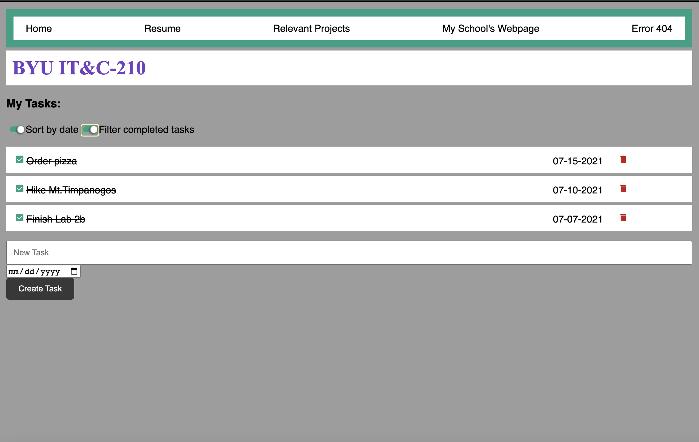
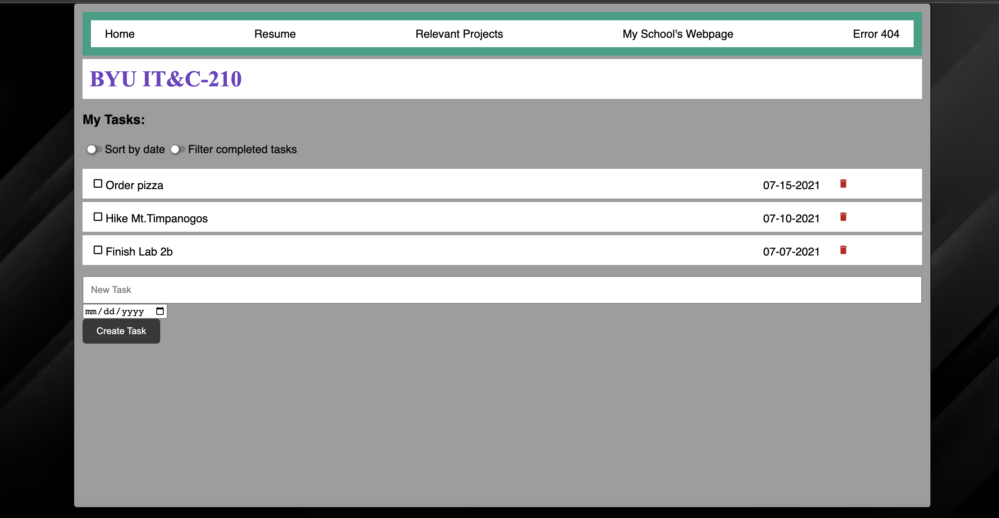

# Introduction 

## Jackson Stephens
## 09/22/2023
## Lab 1

# Executive Summary

 In this lab, I set up a practical development and cloud environment to host a web application. By doing so, also initializing and setting up essential tools like Docker, my AWS instance, and VSCode. Diving deeper into the content of the lab, I made a favicon for a website that I programmed in HTML and CSS. I also pushed all this code to github using git for version control. 

# Design Overview 

Lab 1 was broken up into two parts: 1A and 1B. Lab 1A focused on software setup, initialization, and creating a basic HTML/ CSS framework for our task list website. In this lab, we used a Docker container to host a local development instance to test code. This Docker container is connected to VSCode through an extension, set up with our "docker-compose.yml" file configuring an Apache HTTP server. This is done through port forwarding and volume mapping to sync the project and container. 

The website that we created has a main function of being a task list application. This being composed of a nav bar, list variations, and a form that has the capability to be programmed to intake dates, tasks, and subsequently be deleted. The HTML written served as a bare bones, general framework for the website. The CSS added more dynamic contrast, color, and formatting to the webpage. Specific to my website, I imported a bootstrap purple to showcase the title, "BYU IT&C-210" while also accenting the page with the sort by buttons accent green. I gave the background a custom, black, sleek image. I imported a custom button for the trash icon. I also added dynamics to the hover function while making a new task. 

## Files used: 

src: the src folder is the general folder that holds all of my other website elements. 

index.html: this was the framework for the website. Code for the nav bar, title, task list, and form for tasks was written in this document. 

favicon.ico: the favicon image I created, put into the tab of the web browser for my website. 

docker-compose.yml: this was the configuration file for my Docker container hosting the Apache HTTP server. This image being port forwarded, and mapped to the src folder. 

script.js: this file had pre-written code destined for it regarding form submission testing. 

style.css: this file made my website look pretty. I added bootstrap elements, page sizing and reformatting dependent upon screen size, formatting, and other style to my website.

# Writeup Questions

## - What is the purpose of using Docker containers?

Docker containers gives me the flexibility to work and edit the website I'm creating and see the changes in real time. They're also incredibly resource efficient, running on the hardware specific to your computer. 

## - Why is it useful to have both a development environment and a live server environment?

It is useful to have both a development environment and live server environment because this would be the exact same scenario given to you by an employer or company. The initialization and setup is the hardest part of live server environments. This has given us experience in that field. It also gives us the ability to practice isolated testing, to be then pushed as a final product, similar to how a dev team would operate. 

## - What is the purpose of using a code versioning tool (i.e. Git)

Git is a tool that helps with version control, code backup, and conflict resolution. I have had multiple instances where my code had conflicts, or wasn't properly pulled or pushed in the right directory. Git was the tool that helped solve those problems, and add backups to my files to github. 

## - What is the difference between a CSS rule with an *element* selector (i.e. h1,p,div etc.) and one with a *class* selector (i.e. .task, .task-done etc.)? When would you use each?

An element selector applies style to every element with the same name, without having to be further called in the HTML file. However, these styles may be overwritten with the use of a Class or ID. Classes target elements in the HTML that have been called with a specific class selector. Elements have more generality. Classes have more specificity and use cases. 

## - What are the advantages of putting your styles in a separate .css stylesheet instead of in the `<style>` element of `<head>`?

Having style elements separate in a .css stylesheet give your HTML file more clarity. You are able to see the framework flow better. Moreover, it also allows for concise customization and reusability. 

## - How do web browsers choose which CSS to use for an HTML element when the CSS rules contradict each other? What is the order of precedence for CSS rules?

Web browsers follow this order of precedence for CSS rules: inline, embedded, external, specificity, order, and lastly, !important. Using !important may add more problems that it will resolve. Generally, you would look to prioritize CSS with the solutions well above it in the hierarchy. 

## - Why should you disable directory access for your server?

Disabling directory access for my server give the server itself more direction as to where to pull information from. Also, doing so adds an extra layer of security, protecting sensitive data and information from unauthorized users and data breaches. 

# Lessons Learned: 
## Symbolic Link Mapping Issues

While setting up the cloud hosted website through my AWS instance, I could not map the location of my index.html file to present it on my website. I tried countless pathways to the file, each resulting in a loading error of the website. I kept trying to map this to a directory specific to my local device. For example, creating the symbolic link to a path like: ln -s /var/www/desktop/210/lab-1a-Jackyroo42/instructions/src/ html. After spending countless hours and working amongst peers, I decided to sleep on it and ask a TA in the morning during pass-off. Thankfully this issue was able to be resolved with this proper path: ln -s /var/www/lab-1a-Jackyroo42/instructions/src html. 

## Task Bar Vertical Alignment:

While trying to align the text on my taskbar, I couldn't make the css classes in the external file respond to the HTML that I had written. I found out that the reason this was happening was because I had one general  element, which affected the inheritance of the classes to each specific part of the task bar. In order to fix this, I reformatted the task bar so that each indivdual element needing specific classes was able to recieve the properties necessary to align veritcally with one another. 

## Docker:

At the end of this lab, I made the fatal mistake of updating my Desktop Docker app. This app, once changed, affects with the Docker image made in the docker-compose.yml folder. This happened because the version advertised in the image of the Docker did not align with the image set on the Docker container itself. Furthermore, this also caused a separate Docker container to be made which had conflicting IP's with the previous container. In order to fix this, I had to delete every Docker related item on my computer, download a previous version of the Docker desktop, then copy my old docker-compose.yml image from lab 1A. 

# Conclusion 

* Create a local, development website using a Docker container.
* Pushed my website code to github, later to an AWS instance which is a cloud hosted server. 
* Dynamically formatted and customize my website with an HTML framework that I coded. 
* Set up IDE, text editor programs to run and test code like Visual Studio Code. 
* Create simple HTML forms meant for submissions with Javascript. 
* Used git version control in order to push and pull code saved for my website. 
* Secure my website by disabling directory access, enhancing its security. 

# References 

[Web3Schools](https://www.w3schools.com/)
[StackOverflow](https://stackoverflow.com/)
[MozillaCSSGITLab](https://developer.mozilla.org/en-US/docs/Web/CSS)
[HTMLOverview](https://html.com/)
[JavaScriptOverview](https://www.javascript.com/)

